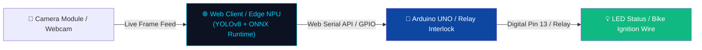

# 🪖 Helixo AI — Smart Helmet Detection & Vehicle Ignition Interlock System

> **Global Innovation Hackathon 2026 – Build for a Better Future**  
> *Category: Smart Cities, IoT & Road Safety Engineering*


---

## 🔗 Project Links & Prototype Demonstration

| Resource | Link / Access |
|---|---|
| 🌐 **Live Web Application** | [https://curious-dieffenbachia-090c3f.netlify.app/](https://curious-dieffenbachia-090c3f.netlify.app/) |
| 🎬 **YouTube Prototype Demo Video** | [Watch Helixo AI Demo on YouTube](https://youtu.be/9xvNzz3kymY) |
| 📊 **Hackathon Pitch Deck** | [`Helixo_AI_Pitch_Deck.pptx`](./Helixo_AI_Pitch_Deck.pptx) |

---

## 📌 Executive Summary

**Helixo AI** is an IoT and Edge-AI powered road safety solution designed to enforce two-wheeler helmet compliance before motorcycle/scooter engine ignition can be enabled. 

By combining real-time computer vision (YOLOv8-nano object detection) running client-side via **ONNX Runtime Web** with hardware-level relay interlocking via **Arduino UNO / Kendryte K210**, Helixo AI creates an offline-capable, fail-safe mechanism that prevents unhelmeted riding.

---

## 💡 Problem Statement

According to global road safety statistics, two-wheeler accidents account for a major share of traffic fatalities, with traumatic brain injuries (TBI) being the leading cause of death. Despite traffic laws, enforcement remains challenging in low-policed areas. 

**Existing solutions fail because:**
1. Traditional helmet straps lack electronic enforcement.
2. Cloud-dependent vision systems introduce latency, privacy issues, and fail without internet connection.
3. Simple limit-switches in helmets can be bypassed easily.

---

## ⚡ Key Innovations & Features

- **🚀 100% Client-Side / Edge Computer Vision:** Runs YOLOv8-nano object detection locally in the browser or on dedicated microcontrollers (Kendryte K210 / ESP32-S3). Zero cloud dependencies, low latency (<300ms), and 100% data privacy.
- **🔌 Hardware Serial Relay Control:** Interfaced with Arduino UNO via the Web Serial API to control ignition relays and LED indicators in real time (`H` = Helmet Detected / Ignition Enabled; `N` = No Helmet / Ignition Interlocked).
- **🛡️ Dynamic Fail-Safe Logic:** Native object detection bounding boxes prevent camera occlusion glitches or false positives. If camera feed is blocked or no rider is detected, ignition remains locked.
- **💻 Dual Evaluation Modes:** Real-time continuous webcam feed with HUD overlay telemetry and offline dataset batch testing playground.

---

## 🏗️ System Architecture



---

## 📂 Repository Structure

```
Global-Hackathon-Helixo-AI/
├── 📄 README.md                        # Project documentation & overview
├── 📄 LICENSE                          # Open-source MIT License
├── 📊 Helixo_AI_Pitch_Deck.pptx        # Official Hackathon Pitch Deck Presentation
│
├── 🌐 web_prototype/                   # Web Application (YOLOv8 + ONNX + Web Serial API)
│   ├── index.html                      # Futuristic Cyberpunk Dashboard UI
│   ├── app.js                          # Inference engine, camera feed & Web Serial handler
│   ├── style.css                       # High-tech HUD styles & animations
│   └── model/
│       └── best.onnx                   # Exported YOLOv8-nano model (~12 MB)
│
├── 🔌 arduino_firmware/                # Hardware Firmware Code
│   └── helixo_demo.ino                 # Arduino UNO C++ sketch for Serial LED/Relay ignition
│
├── 🤖 ml_pipeline/                     # Machine Learning Pipeline & Training
│   ├── train.py                        # Model training script
│   ├── convert_tflite.py               # TFLite/C++ export converter
│   └── augment_realworld.py            # Data augmentation pipeline
│
└── 📄 docs/                            # Technical reports & architecture diagrams
    ├── Helixo_AI_Project_Details.pdf
    ├── Helixo_AI_Problem_Statement.pdf
    └── Helixo_V2_Execution_Plan.md
```

---

## 🛠️ Hardware Requirements & Circuit Wiring

| Component | Quantity | Description / Connection |
|---|---|---|
| **Arduino UNO / Nano** | 1 | Microcontroller board for relay/LED switching |
| **USB Type-A to B Cable** | 1 | Serial data connection between Laptop & Arduino |
| **5V Single Channel Relay Module** | 1 | Interlocked inline with Motorcycle Ignition wire |
| **LED + 220Ω Resistor (Optional)** | 1 | Visual ignition status (Pin 13 built-in LED supported) |

### Wiring Pinout:
- **Pin 13 (or Pin 7):** Signal to Relay Module IN / LED Positive
- **5V & GND:** Power supply to Relay Module
- **Relay COM & NO:** Wired in series with bike ignition switch

---

## 🚀 Quick Start & How to Run

### 1. Arduino Setup:
1. Connect Arduino UNO to PC/Laptop via USB.
2. Open `arduino_firmware/helixo_demo.ino` in Arduino IDE.
3. Select **Board: Arduino Uno** and the corresponding **COM Port**.
4. Click **Upload**. (Built-in LED blinks 3 times on boot to signal readiness).
5. **IMPORTANT:** Close the Arduino IDE Serial Monitor window after uploading.

### 2. Running Web Prototype:
1. Open Google Chrome or Microsoft Edge (Web Serial API compatible browsers).
2. Launch the live demo web app: [https://curious-dieffenbachia-090c3f.netlify.app/](https://curious-dieffenbachia-090c3f.netlify.app/)
3. Click **"🔌 Connect Arduino"** in the top navbar and select your Arduino COM Port.
4. Click **"▶ Start Camera Stream"**.
5. Test helmet compliance live on webcam!

---

## 📜 License

This project is licensed under the MIT License - see the [LICENSE](LICENSE) file for details.

---

<p center>
  Developed with ❤️ for <strong>Global Innovation Hackathon 2026 – Build for a Better Future</strong>
</p>
